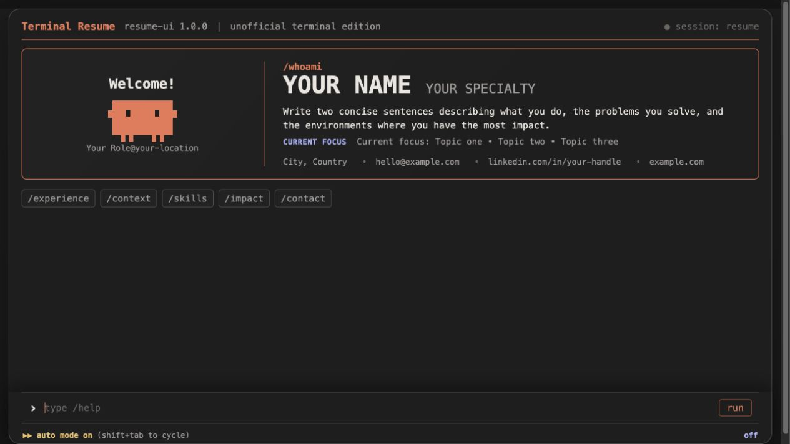

# Terminal resume starter

A forkable terminal-style resume with placeholder content. Personalize one profile file, enable the command modules you want, and deploy the generated static site anywhere.



## Start here

```bash
git clone git@github.com:gengisb/resume.git
cd resume
npm install
npm run dev
```

Open `http://localhost:3210/` and type `/help`. The project also works with pnpm.

## Add your information

Edit [`src/profile.js`](src/profile.js). The file starts with neutral placeholders for:

- the page title and terminal header;
- experience, skills, impact, and contact details;
- the `/context` heatmap;
- optional local AI context.

No personal resume is included in this repository.

## Choose your commands

The starter enables a small set of modules:

```text
/whoami
/experience
/context
/skills
/impact
/contact
```

Enabled modules are listed in [`src/commands/index.js`](src/commands/index.js). Removing a module from that registry removes it from routing, autocomplete, aliases, and `/help`.

## Add a command module

Copy [`src/commands/example.command.js`](src/commands/example.command.js), rename it, and register it in [`src/commands/index.js`](src/commands/index.js).

```js
import { escapeHtml } from '../lib/html.js';
import { defineCommand } from './define-command.js';

export default defineCommand({
  name: '/now',
  description: 'Show what you are working on now',
  aliases: ['/current'],
  dataKey: 'currentWork',
  defaults: ['Replace this sample'],
  render: ({ data }) => `<p>${escapeHtml(data.join(' · '))}</p>`,
});
```

`dataKey` reads matching content from `src/profile.js`. If that field is absent, the command uses `defaults`. The terminal passes both values to `render({ data, profile })`.

Interactive modules can also provide `onRender({ panel, run, input })`. Use it to attach behavior to the rendered panel without changing the terminal engine.

## Project structure

```text
src/
├── profile.js              # Your public content and AI context
├── resume.config.js        # Exports the active profile
├── main.js                 # Terminal UI and optional browser model
├── styles.css              # Theme and responsive layout
├── ai/
│   └── resume-context.js   # Selects relevant profile context
├── commands/
│   ├── index.js            # Enabled command modules
│   ├── define-command.js   # Shared command contract
│   └── *.js                # One file per slash command
└── lib/
    └── html.js             # Escaping and safe-link helpers
```

Most customization belongs in `src/profile.js` and `src/commands/`. The terminal engine should rarely need changes.

## Optional browser AI

The UI can run supported small language models in the visitor's browser. Model weights download only after the visitor chooses a model, then the browser caches them. WebGPU support is required.

Keep the assistant grounded by replacing `ai.coreContext` and `ai.sections` in `src/profile.js` with concise, public facts. The default system prompt tells the assistant that it is not the resume owner and must not invent missing details.

## Build

```bash
npm run validate
npm run build
```

The deployable site is written to `dist/static/`.

## Check before publishing

```bash
npm run check:public
```

This scans tracked files for common credentials, private keys, local filesystem paths, private deployment details, and accidentally committed environment files. Review the staged changes yourself before pushing because no automated scan can guarantee that every private detail has been removed.
